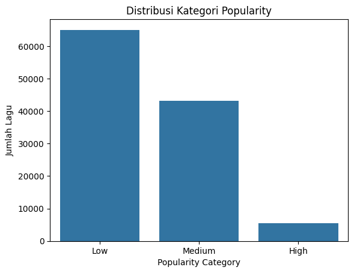
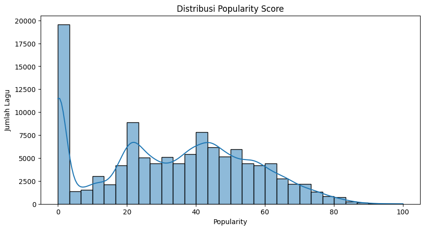
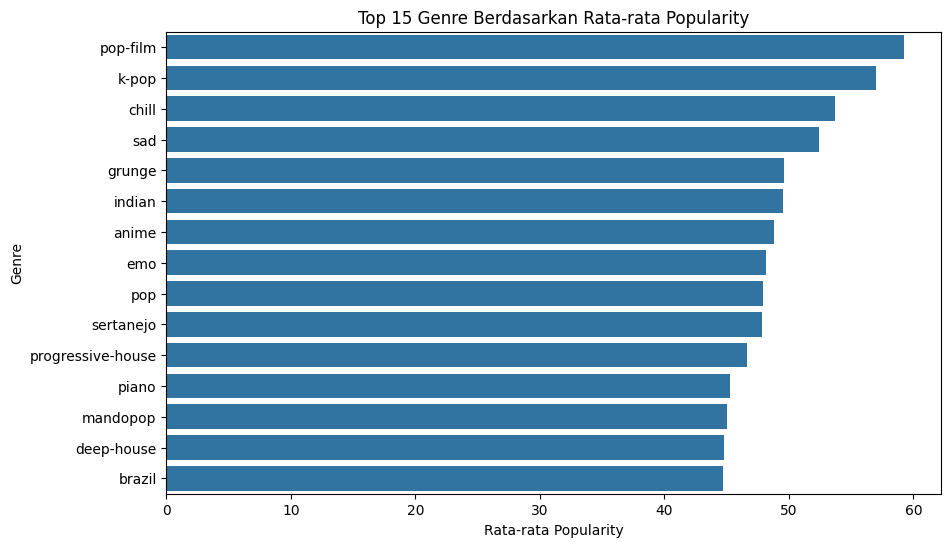
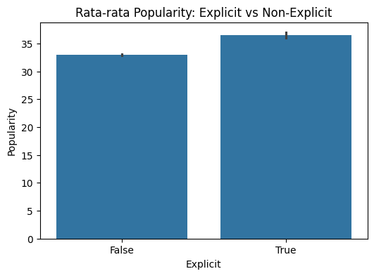
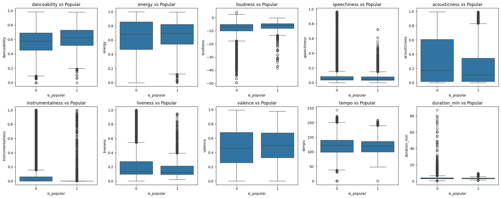
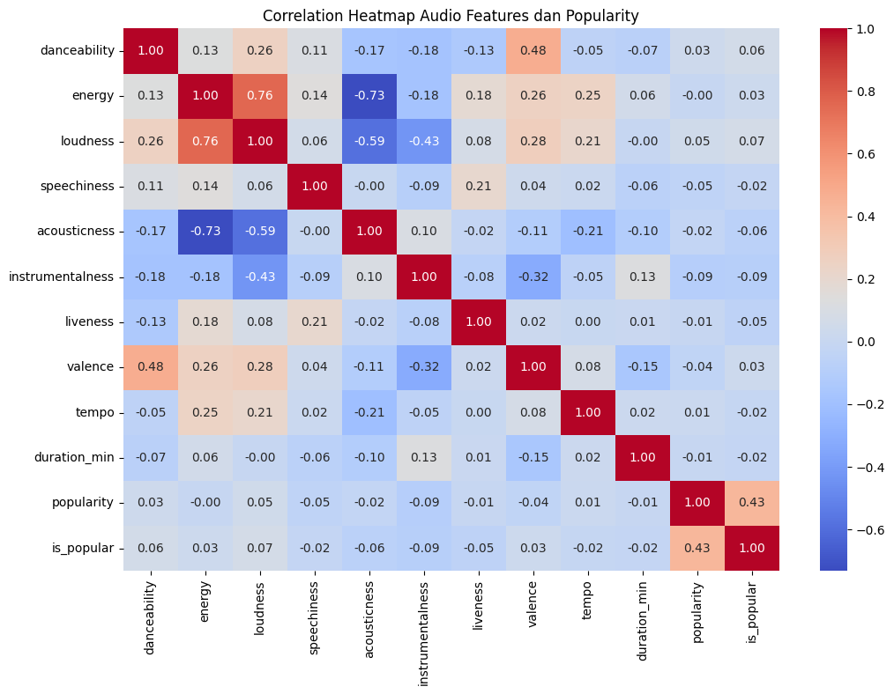
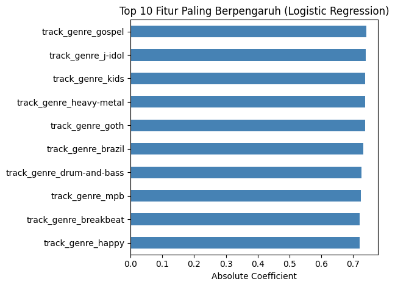
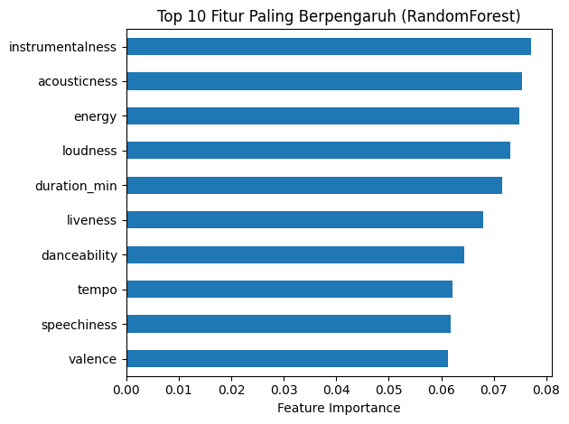
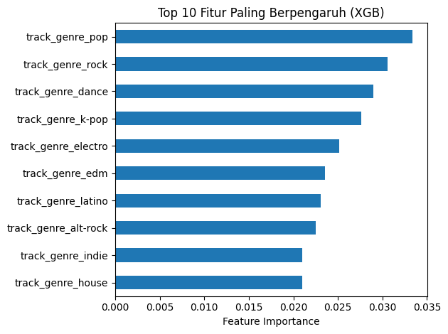

# 🎵 Spotify Music Trends Analysis

## Business Problem
Bagaimana karakteristik audio dan genre lagu memengaruhi popularitas, dan bagaimana insight tersebut dapat digunakan untuk strategi playlist yang lebih relevan?

## Dataset
- **Source**: [Kaggle - Spotify Tracks Dataset](https://www.kaggle.com/datasets/maharshipandya/-spotify-tracks-dataset)
- **Size**: ~114.000 lagu, 20 kolom, 114 genre
- **Target**: `is_popular` (popularity ≥ 70)

## Tools & Technologies
Python · Pandas · NumPy · Seaborn · Matplotlib · Scikit-learn · Tableau

## Links
- 📓 [Kaggle Notebook](https://www.kaggle.com/code/zx1700/da02-spotify) 
<!-- 📊 [Tableau Dashboard](#) Ganti dengan link Tableau Public kamu -->

---

## Analysis & Results

### 1. Data Overview
- **~114.000 lagu** dari 114 genre berbeda
- **450 data duplikat** dihapus saat cleaning
- Missing value minimal pada kolom teks (`artists`, `album_name`)

### 2. Distribusi Popularity

| Kategori | Persentase |
|---|---|
| Low (0-39) | **57.2%** |
| Medium (40-69) | **37.9%** |
| High (≥70) | **4.8%** |

Hanya **4.8%** lagu yang tergolong populer — lagu populer adalah "barang langka" di Spotify.

### 3. Top Genre Berdasarkan Popularity

| Rank | Genre | Avg Popularity |
|---|---|---|
| 1 | pop-film | **59.3** |
| 2 | k-pop | **57.0** |
| 3 | chill | **53.7** |
| 4 | sad | **52.4** |
| 5 | grunge | **49.6** |

### 4. Explicit vs Non-Explicit

Lagu **explicit** (konten dewasa/kasar) memiliki rata-rata popularity **sedikit lebih tinggi** dibanding non-explicit. Namun perbedaannya **tidak signifikan**.

### 5. Audio Features: Populer vs Tidak Populer

Boxplot perbandingan menunjukkan perbedaan distribusi audio features antara lagu populer dan tidak populer.

### 6. Correlation Heatmap

| Audio Feature | Korelasi dengan Popularity |
|---|---|
| **loudness** | Positif terkuat ↑ |
| **danceability** | Positif lemah ↑ |
| **energy** | Positif lemah ↑ |
| **acousticness** | Negatif ↓ |
| **instrumentalness** | Negatif ↓ |

> Lagu populer cenderung: **lebih keras, lebih danceable, kurang akustik**.

### 7. Feature Importance

#### Logistic Regression

#### Random Forest

#### XGBoost

---

## Key Findings
1. Hanya **4.8% lagu** yang populer (popularity ≥ 70)
2. **Loudness** = korelasi positif terkuat dengan popularity
3. **Acousticness & instrumentalness** berkorelasi negatif
4. **pop-film, k-pop, chill** = top 3 genre terpopuler
5. Explicit sedikit lebih populer, tapi **bukan faktor utama**
6. Kolom `artists` dan `album_name` **tidak digunakan** untuk modeling karena nilai unik terlalu banyak (31.000+ artis) — tujuan analisis adalah mencari pola dari karakteristik audio, bukan dari nama artis

## Recommendations
- **Playlist "Hits"**: Prioritaskan lagu dengan loudness tinggi, danceability tinggi, acousticness rendah
- **Genre Strategy**: pop-film, k-pop, dan chill bisa jadi genre andalan playlist utama
- **Discovery Playlist**: Gunakan model prediksi untuk menemukan lagu potensial dari artis baru
- **Mood-based Playlist**: Manfaatkan valence, energy, dan tempo untuk playlist berdasarkan mood

---

*Project ini merupakan bagian dari portfolio Data Analyst.*
